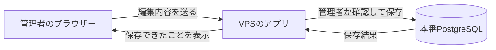
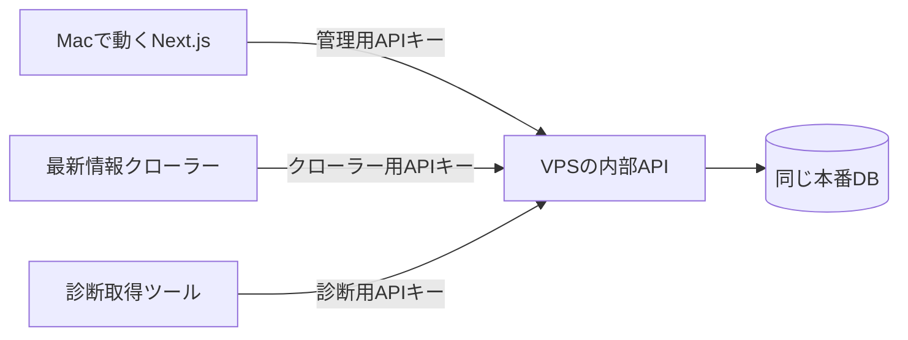
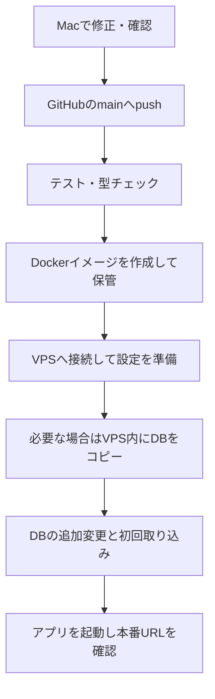

# 基本から理解する：Rusutsuのサーバーと今回の変更

この資料は、「指示どおりに操作するだけでなく、何が起きているのかも分かりたい」人向けです。
順番に読むと、サーバー・DB・Docker・API・GitHub Actionsが、このアプリでどうつながるか分かる構成です。
実際の操作は別冊の[やること手順書](backend-migration-beginner-guide.md)にまとめています。

旧称・ふりがなもDBに保存し、管理画面から変更できるようになりました。
AIで作成するレビューは、JSONを制作物として残し、公開時にAPI経由でDBへ保存します。
具体的な操作は[日常のデータ編集・レビュー公開手順](content-publishing-guide.md)を参照してください。

## 1. 最初に、3つのものを区別する

サイトを考えるときは、まず次の3つを分けると理解しやすくなります。

| 名前 | Rusutsuでの具体例 |
| --- | --- |
| プログラム | 地図を表示する、料金を計算する、編集結果を保存する、という処理の手順 |
| データ | スキー場の名前、料金、レビュー、リフトの運行状況などの内容 |
| コンピューター | プログラムを動かし、データを保存する機械 |

「料金を1,000円変更する」のはデータの変更です。
「料金表に新しいボタンを付ける」のはプログラムの変更です。
**プログラムを新しくするたびに、データまで最初の状態へ戻ると困る**ので、今回の変更でその境界を整理します。

## 2. サーバーとは何か。VPSとは何か

あなたがブラウザーでサイトを開くと、ブラウザーはインターネット越しに「このページをください」と要求します。
その要求に応答するコンピューターやソフトウェアを「サーバー」と呼びます。

Rusutsuでは、友人が管理するVPSでサーバー用プログラムが動いています。
VPSは、インターネット上で利用できる仮想的なコンピューターです。
あなたのMacとは別に動くため、Macを閉じても本番サイトは動き続けます。

| 場所 | 役割 |
| --- | --- |
| あなたのMac | プログラムを修正し、確認する場所。「ローカル」とも呼ぶ |
| GitHub | プログラムの履歴を保管し、自動検査や公開処理を実行する場所 |
| VPS | 一般利用者向けの本番アプリと、本番DBを動かす場所 |
| 利用者のブラウザー | サーバーから受け取った内容を表示し、ボタン操作などを送る場所 |

「本番」は、実際の利用者が使う環境という意味です。
Macの確認用画面で成功したことと、本番でも正常に動いたことは別に確認します。

## 3. データベースは、アプリが使う整理された保管庫

データベースを略して「DB」と呼びます。
Rusutsuは、PostgreSQLというデータベース用ソフトウェアを使います。

DBの中には「テーブル」という表があります。
たとえばスキー場の表には、名前、所在地、短縮名、公開するかどうか、という列があります。
表の1行が1スキー場に対応する、と考えてください。

| ID | 名前 | 短縮名 | 公開するか |
| --- | --- | --- | --- |
| example-resort | サンプルスキーリゾート | サンプル | true |

これは説明用の架空の行です。IDは、表記が変わっても同じスキー場を識別するための印です。
料金・レビューなどは構造が複雑なので、JSONの文書として保存する専用の表も用意しています。

JSONは、名前と値を組み合わせてデータを表す書き方です。
GeoJSONは、座標などの地理情報を表すJSONの形式です。
**JSONはデータの形式、DBはその保存先**なので、JSONをDBに保存することもできます。

### クローラー由来のデータなら、全部取り直せる？

クローラーは、公式サイトなどから情報を取得するプログラムです。
基本情報の多くはそのように集めたものですが、今も同じ内容を取得できるとは限りません。
掲載が終わった情報や、過去の日付の記録もあるためです。
また、移行後に管理者が入力・修正した内容は、クローラーでは再現できません。

今回の移行では、今の基本情報を残して使います。基本情報の作り直しのために古いクローラーを動かす処理は入れません。

## 4. 今回、DBに対して何を変えるのか

今回の処理は、**既存データを残したまま、保存場所や項目を追加する変更**です。

| 変更 | 何ができるようになるか |
| --- | --- |
| 料金・レビュー・コース・リフト等を保存する表を追加 | 管理画面の編集結果を本番DBに集約できる |
| スキー場の短縮名の列を追加 | 地図に出す短い名前を管理画面から直せる |
| 公開・非公開の列を追加 | 閉業施設を削除せず、公開だけ止められる |
| クローラーの実行結果・問題の記録用の表を追加 | いつ取得し、何がうまくいかなかったか調べられる |
| 初回取り込みの完了記録を追加 | 同じ移行元ファイルを毎回投入しないようにできる |

DBの構造を変更する手順を「マイグレーション」と呼びます。
このプロジェクトではPrismaというツールが、「どの変更を適用したか」を記録し、まだ適用していない分だけ進めます。
通常の公開ごとに、DB全体を削除して作り直す仕組みではありません。

### 初回の取り込みは、構造変更とは別

表を追加しただけでは、その表の中身は空です。
そこで最初の1回だけ、Git側に残っている料金・レビュー等のJSON/GeoJSONと短縮名を読み、DBへ取り込みます。
既存の編集済み文書や設定済み短縮名は上書きしません。

完了すると、DBに「取り込み済み」という記録を残します。
その後は管理画面で編集したDBの値を使い、次の公開で古いファイルを自動投入しません。
DBから文書を消した場合にも、次回起動で古い文書が勝手に復活することはありません。

## 5. 管理画面で「保存」を押すと何が起きるか

ブラウザーがDBへ直接ログインするわけではありません。
アプリがログイン状態と権限を確認してから、DBを読み書きします。
ここでアプリを動かす仕組みがNode.js、Webアプリを組み立てる仕組みがNext.jsです。
ブラウザーから呼ぶ保存の窓口には、Next.jsのServer Actionsも使っています。

複数の管理者が使っても、保存先は同じ本番DBです。
同じ文書を同時に編集した場合は、読み込んだときの版と現在の版を比べ、競合を検出します。
別の人が先に更新した内容を、後の保存で無言で消さないためです。
ただし、過去の本文をすべて一覧できる完全な編集履歴は、まだ実装していません。

一般利用者の画面も、このDBから表示に必要な内容を取り出します。
短縮名などの公開データを変更すると、ページの再取得時に新しい値が使われます。

## 6. APIとAPIキーは何のためにあるか

APIは、プログラム同士でデータを受け渡す窓口です。
今回の内部APIは、本番DBをMacやクローラーから使うために用意しています。

| キーの用途 | 許可する作業 |
| --- | --- |
| 管理用 | 運用データの読み書き |
| クローラー用 | 取得結果と警告・失敗の記録を送る |
| 診断取得用 | 警告・失敗の記録や保存したページを取得する |

3つを別のキーにすることで、クローラーに管理者用の権限まで渡さずに済みます。
APIキーはGoogleログイン用のパスワードとも別です。

### Macから編集する場合にも、保存先は本番にできる

移行後にMacのNext.jsをAPIモードにすると、Macのサーバー側の処理が本番APIを呼びます。
APIキーはMacの`.env.local`などに置き、ブラウザーに渡しません。
このモードで保存すると、本番データが変わります。ローカルだけの練習用データではありません。
Macの認証用DBと、本番の運用データは役割が違います。本番DBの接続パスワードをMacへ配る必要はありません。

### ブラウザーからは何が見える？

地図を描く座標や、画面に出す料金などは、表示のためにブラウザーへ送ります。
その内容は開発者ツールからも確認できます。
内部APIキーや、表示に不要な管理用の元データは送らない、という分け方です。
一般利用者がサイトを見るために、APIキーを入力する必要はありません。

## 7. Dockerは「アプリの実行環境をそろえる」仕組み

MacとVPSでは、入っているソフトウェアや設定が違います。
そこで、アプリと実行に必要なものをパッケージにして、VPSで動かせるようにするのがDockerの役割です。

| 用語 | このプロジェクトでの意味 |
| --- | --- |
| イメージ | アプリのコードや必要なライブラリをまとめた、実行用パッケージ |
| コンテナ | イメージをもとに作り、実際に動かしている環境 |
| volume | コンテナを交換しても残す、データ用の保存領域 |
| Docker Compose | アプリ・DB・定期クローラーを、どんな設定で組み合わせるか管理する仕組み |

Rusutsuでは、おおむね次の3つのコンテナが動きます。

- アプリ：公開画面・管理画面・内部APIを提供する。
- DB：PostgreSQLがデータを管理する。
- 最新情報の定期クローラー：決めた時刻に取得処理を動かす。

DBの中身は`postgres_data`という役割のvolumeに置きます。
今回の公開処理は、既存DBが使っているvolumeの実際の名前を確認し、そのまま使います。
見つからないときは停止し、別の空volumeで代用しません。

**アプリのコンテナを交換することと、DBのデータを消すことは別です。**
アプリの公開処理ではコンテナを入れ替えますが、DBの保存領域は保持します。

## 8. GitHubに送ると、なぜ本番が更新されるのか

Gitはプログラムの変更履歴を管理する仕組み、GitHubはその履歴を置くサービスです。

| 操作 | 意味 |
| --- | --- |
| commit | 変更を履歴として記録する |
| push | その履歴をGitHubへ送る |
| build | ソースコードから実行できるものを組み立てる |
| deploy | 実行用パッケージをVPSへ届け、動く状態にする。本番反映・公開とも呼ぶ |

GitHub Actionsは、「mainにpushされたら検査して公開する」などの自動作業を動かします。
自動作業の定義は`.github/workflows/`にあるファイルです。

実行用パッケージの保管先がGHCRです。GitHub ActionsはSSHという方法でVPSに接続し、Dockerを操作します。
既存のTailscale設定は、その接続経路を用意するために使っています。
これらはすでにある公開の仕組みを引き続き使います。

検査やコピーに失敗した場合は、それより後の処理を進めません。
DB変更後や起動後に失敗した場合も、勝手にDB全体を古い状態へ戻しません。
失敗した工程を見て、原因を修正して再実行するか、復旧が必要かを判断します。

`src/private`は、アプリ本体とは別にGitで管理する部分です。これがsubmoduleです。
その変更を先にGitHubへ送り、アプリ本体がその版を参照することで、同じ組み合わせを公開できます。

## 9. GitHub Settingsは、プログラムに渡す設定の置き場

コードにパスワードを書いて保存すると、コードを読める人に見えてしまいます。
そこで、動作に必要な値をコードと分けて保管し、実行するときに渡します。
このようにプログラムへ渡す設定を「環境変数」と呼びます。

| GitHubでの置き場 | 例 | 扱い |
| --- | --- | --- |
| Secrets | APIキー、SSHの鍵 | 秘密として保管し、必要な自動処理へ渡す |
| Variables | 本番URL、初回取り込みのON/OFF | 通常の設定値として保管する |

新しい公開処理は、次の順に設定を用意します。

1. GitHubから、新しいAPIキー3つなどを受け取る。
2. 稼働中のコンテナから、今のDB・ログイン設定・使用ポートを読み取る。
3. 引き継ぐ値と、新しく指定された値を組み合わせる。
4. 既存のDBと一致しているか検査する。
5. VPSのSSH実行ユーザーだけが通常読み書きできる設定ファイルを自動作成する。
6. その設定でアプリを起動し、成功後に正式な設定として保存する。

そのため、VPSの`.env`を手で編集することが通常手順からなくなります。
元の`.env`は上書きせず、生成した設定はGitの外に置きます。
VPS管理者などの強い権限を持つ人からも秘密を隠す、という意味ではありません。

**SecretsやVariablesを保存しても、それだけでは稼働中のアプリは変わりません。**
次にCI/CDを実行したときに、新しい設定が渡ります。
GitHubの設定を変えた後でRun workflowを押すのは、このためです。

## 10. 今回のバックアップは、どこに何を残すのか

今回は、VPS内にDB全体のコピーを残します。外部ストレージには送信しません。
保存先は、SSH実行ユーザーのホーム内の`~/.local/state/rusutsu/<既存プロジェクト名>/backups/`です。
フォルダーは公開処理が自動で作るため、友人に作成を頼む必要はありません。

| タイミング | コピーする理由 |
| --- | --- |
| DB構造変更・初回取り込みなどの前 | 今回の変更前の状態を残す |
| 毎日01:15の予定 | 普段の管理画面での編集結果なども残す |

UIだけの修正や、クローラーファイルを追加するだけの場合は、公開前のDBコピーを省きます。
毎日のコピーは、GitHubへpushがない日も実行します。

PostgreSQLの`pg_dump`という道具でコピーし、空でないこと・読み取れる形式であること・内容のチェックサムを確認します。
チェックサムは、ファイルの内容から計算する照合用の値です。内容が変わると値も変わるため、破損の検出に使えます。
通常は新しい30世代を残し、7日以内のコピーも保持します。

復元試験では、コピーを別の一時的なPostgreSQLへ読み込みます。
本番の保存領域を使わず、外部へ接続しない使い捨て環境で確認し、試験後に片付けます。
Actionsの`test_restore`は、この試験を追加するスイッチです。

VPS内のコピーには、ログイン関連のデータも含まれます。一般公開せず、ファイルの権限を制限します。
今回は暗号化用の別の鍵や、外部サービスの認証情報を用意しません。
VPS自体のディスクを失った場合はコピーも失うので、その障害への備えは今回の構成に含まれません。

## 11. クローラーの定期実行と、失敗したときの記録

最新営業情報の取得は毎日07:00、雪マジは毎日03:00に予定しています。どちらも日本時間です。
アプリやクローラーのコンテナを起動した直後には実行しません。
同じ処理が重なって動かないように制御します。

公式サイトの表示が予想と違う場合、推測して営業状態を保存することは避けます。
問題があるカテゴリを保留し、前回の正常な値を残します。別の正常なカテゴリは更新できる場合があります。
雪マジは取得と検証が全体で成功した場合だけ更新し、一部の取得失敗では既存の情報を変更しません。

警告・失敗の記録には、いつ・どの処理で・何が起きたかを残します。
調査用に保存するページの内容をDOMと呼びます。DOMのファイル自体はDBとは別のvolumeに置き、通常30日を目安に整理します。
DBコピーだけでDOMファイルまで復元できるわけではありません。
エラー通知メールはまだ実装していないので、実行結果を確認する運用が必要です。

## 12. 操作と仕組みを結び付ける

| あなたがする操作 | 裏で起きること |
| --- | --- |
| APIキーをSecretsへ登録 | 次回の公開処理が使う合言葉をGitHubに保管する |
| 初回のVariableをtrueにする | 次の公開時に、ファイルからDBへの初回取り込みを指定する |
| mainへpushする | 自動検査、イメージ作成、VPSへの公開が始まる |
| 管理画面で保存する | 権限を確認したアプリが、本番DBを更新する |
| 初回のVariableをfalseに戻す | 以後の公開で初回取り込みを指定しない |
| 全件収集のVariableをtrueにして再公開する | 最新情報クローラーが次の07:00から定期実行される |
| test_restore付きでバックアップを実行する | VPS内にコピーし、一時DBへ戻せるかも確認する |

実際の入力欄と順番は[やること手順書](backend-migration-beginner-guide.md)へ戻って確認してください。
実装上の詳しい仕様は[設計資料](backend-data-architecture.md)、具体的なコマンドは[運用手順書](backend-migration-runbook.md)にあります。
